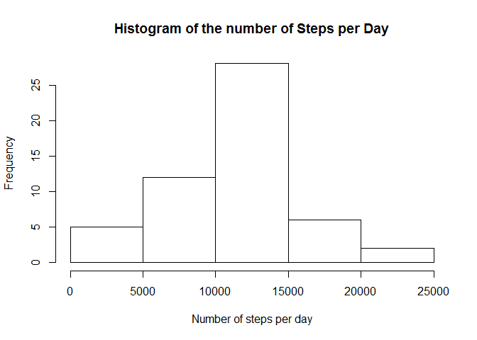
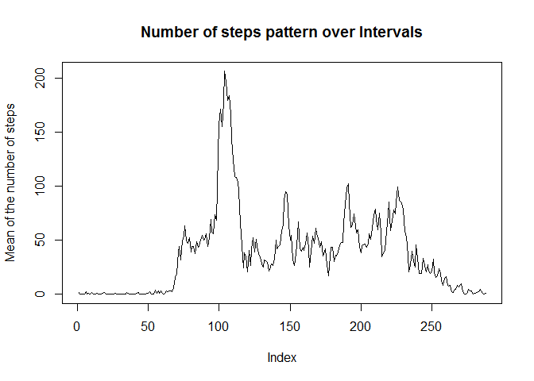
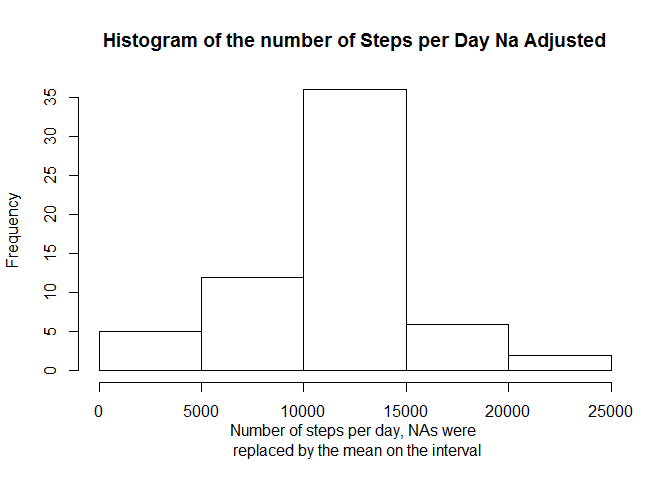
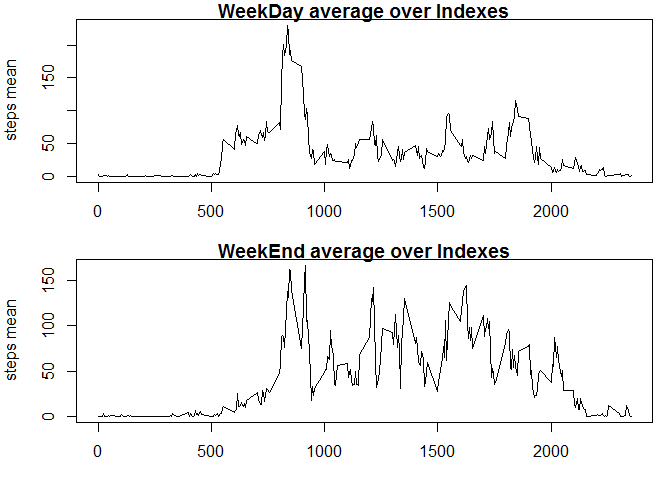

# Reproducible Research: Peer Assessment 1
In this analysis, we are studying the measurement made by smartphone
of the number of steps taken during the day by the owner of the device. 

The set of Observations is over 61 days, counting each 288 intervals of 5 minutes
during which the number of steps is recorded. 

## Loading and preprocessing the data

```r
RawData <- read.csv("activity.csv")
```
A quick look at the data : 

```r
str(RawData)
```

```
## 'data.frame':	17568 obs. of  3 variables:
##  $ steps   : int  NA NA NA NA NA NA NA NA NA NA ...
##  $ date    : Factor w/ 61 levels "2012-10-01","2012-10-02",..: 1 1 1 1 1 1 1 1 1 1 ...
##  $ interval: int  0 5 10 15 20 25 30 35 40 45 ...
```
I decided to use real dates and to remove all the NAs from steps :

```r
bad <- !is.na(RawData$steps)
RawData$date <- as.Date(as.character(RawData$date), "%Y-%m-%d")
Data <- RawData[bad,]
```

A quick look at the cleaned data : 

```r
str(Data)
```

```
## 'data.frame':	15264 obs. of  3 variables:
##  $ steps   : int  0 0 0 0 0 0 0 0 0 0 ...
##  $ date    : Date, format: "2012-10-02" "2012-10-02" ...
##  $ interval: int  0 5 10 15 20 25 30 35 40 45 ...
```

Let us note that apparently we only removed 8 days from the total raw data so the intervals are consistents, we are left with 53 days. 

## What is mean total number of steps taken per day?
In this part we are going to study the primary patterns in the data, namely the number of steps per day. 


```r
sumPerDay <- tapply(Data$steps, Data$date, sum)
```
The results are : 

```r
hist(sumPerDay, main ="Histogram of the number of Steps per Day", xlab = "Number of steps per day")
```

 


```r
mean(sumPerDay)
```

```
## [1] 10766
```

```r
median(sumPerDay)
```

```
## [1] 10765
```


## What is the average daily activity pattern?
Let us compute the data : 

```r
meanPerInterval <- tapply(Data$steps, Data$interval, mean)
head(meanPerInterval)
```

```
##       0       5      10      15      20      25 
## 1.71698 0.33962 0.13208 0.15094 0.07547 2.09434
```
Here is the pattern, we notice a strong pic around the 110 interval and a very flat 
part in the first 70 intervals 

```r
plot(meanPerInterval, type ="l", main = "Number of steps pattern over Intervals", ylab = "Mean of the number of steps")
```

 

## Imputing missing values
Number of missing data : 

```r
sum(bad)
```

```
## [1] 15264
```

Let us replace the missing values with the mean for this given interval 

```r
NaAdjustedData <- RawData
NaAdjustedData$date <- as.Date(as.character(NaAdjustedData$date), "%Y-%m-%d")


for (i in 1:length(RawData$steps))
  if(bad[i] == FALSE)
    NaAdjustedData$steps[i] = meanPerInterval[as.character(NaAdjustedData$interval[i])]

NaAdsumPerDay <- tapply(NaAdjustedData$steps, NaAdjustedData$date, sum)
str(NaAdsumPerDay)
```

```
##  num [1:61(1d)] 10766 126 11352 12116 13294 ...
##  - attr(*, "dimnames")=List of 1
##   ..$ : chr [1:61] "2012-10-01" "2012-10-02" "2012-10-03" "2012-10-04" ...
```


```r
## Plot 
hist(NaAdsumPerDay, main ="Histogram of the number of Steps per Day Na Adjusted", xlab = "Number of steps per day, NAs were \n replaced by the mean on the interval")
```

 

We observe a much stronger average in deed replcing the missing values with the averge we added a lot of record containing average values which induced a much greater frequency for this record. 


```r
mean(NaAdsumPerDay)
```

```
## [1] 10766
```

```r
median(NaAdsumPerDay)  
```

```
## [1] 10766
```


## Are there differences in activity patterns between weekdays and weekends?

Lets study the weekday vs weekend patterns, we are creating a new variable registering this :  

```r
typeDay = factor(c("weekday","weekend"))

for (i in 1:length(NaAdjustedData$date))
  if (weekdays(NaAdjustedData$date[i]) == "dimanche" 
        | weekdays(NaAdjustedData$date[i]) == "samedi")
        typeDay[i] = "weekend"  else typeDay[i] = "weekday"

meanPerTypeDay <- aggregate(NaAdjustedData$steps,list(typeDay,NaAdjustedData$interval), mean)
meanPerTypeWeekDayInterval = subset(meanPerTypeDay, meanPerTypeDay$Group.1 == "weekday")
meanPerTypeWeekEndInterval = subset(meanPerTypeDay, meanPerTypeDay$Group.1 == "weekend")
```
Please note  that I have a french version of the weekdays packages so I need to use the french names of the weekdays ! 


```r
par(mfrow = c(2,1), mar = c(3,4,1,1))
plot(meanPerTypeWeekDayInterval$x ~ meanPerTypeWeekDayInterval$Group.2, type = "l", main = "WeekDay average over Indexes", ylab = "steps mean")
plot(meanPerTypeWeekEndInterval$x ~ meanPerTypeWeekEndInterval$Group.2, type = "l", main = "WeekEnd average over Indexes", ylab = "steps mean")
```

 

We notice a more equaly reparted average during the weekend. 
